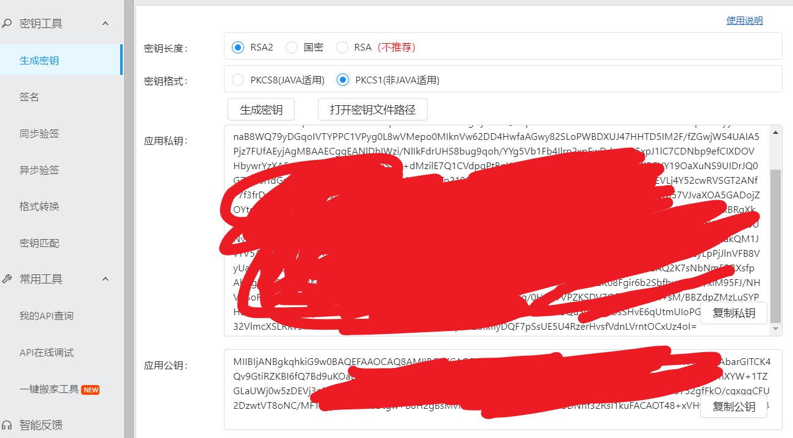
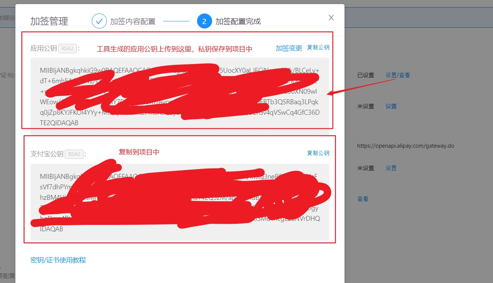
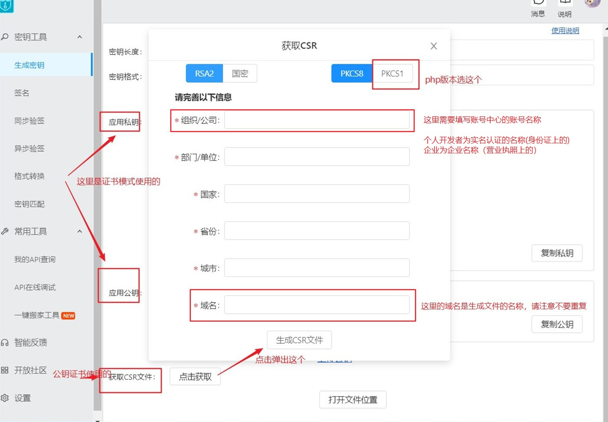

### 简介

laravel 支付模块，支持平台
1. 支付宝
2. 微信

#### 支付宝

签名方式：公钥和公钥证书两种模式

资金类出口生产环境必须使用公钥证书模式

公钥相对于公钥证书模式操作上比较简单，使用支付宝提供的工具生成公钥和秘钥即可

##### 公钥模式

商户公钥、商户私钥、支付宝公钥说明

    商户公钥需要保存到应用配置里面
    
    商户私钥需要保存到项目中（加签使用）

    支付宝公钥需要中应用配置中复制出来，保存到项目中(解签使用)

商户公钥、商户私钥使用工具生成

上传商户公钥、复制支付宝私钥

#### 公钥证书模式

使用支付宝工具生成公钥证书

注意事项：

1. 组织/公司填写的时候要去账号中心查看账号名称，个人的对应身份证的名字，企业的对应营业执照上的企业名称
2. 域名是生成文件的名字，需要妥善保存，请注意保存，以及覆盖的问题

